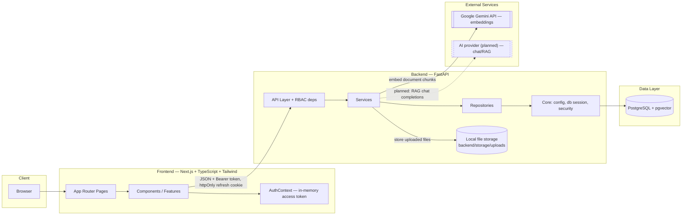
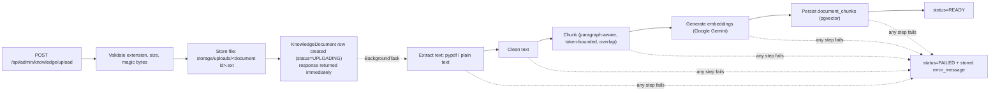

# Architecture

## Overview

The platform is a monorepo containing a Next.js frontend, a FastAPI backend, and a
PostgreSQL + pgvector database, orchestrated locally with Docker Compose.

This document reflects **Phase 1–3**: project foundation, authentication/RBAC, and the
knowledge-base document-ingestion pipeline. The AI chat/RAG assistant and support ticketing
are later phases and not yet reflected here.

## Diagram

## Component responsibilities

| Layer | Responsibility |
|---|---|
| `frontend/app` | Routes and pages (Next.js App Router): `/`, `/login`, `/register`, `/dashboard`, `/admin`, `/knowledge`, `/knowledge/[id]`, `/knowledge/upload` |
| `frontend/components` | Shared, reusable presentational UI components (e.g. role-aware `NavBar`) |
| `frontend/features` | Feature-scoped UI + logic (`auth`, `knowledge`, `system-status`) |
| `frontend/hooks` | Reusable React hooks |
| `frontend/lib` | Client-side utilities and configuration (API fetch wrapper) |
| `frontend/types` | Shared TypeScript types |
| `backend/app/api` | HTTP route definitions (FastAPI routers) + RBAC dependencies (`deps.py`) |
| `backend/app/core` | App configuration, database session, password/JWT security, rate limiter |
| `backend/app/models` | SQLAlchemy ORM models |
| `backend/app/schemas` | Pydantic request/response schemas |
| `backend/app/services` | Business logic, orchestration (auth lifecycle; document ingestion pipeline) |
| `backend/app/repositories` | Data-access layer (queries), isolated from services |
| `backend/app/scripts` | One-off scripts: dev admin seed, demo knowledge-base seed |
| `backend/app/utils` | Small stateless helper functions (password policy) |
| `backend/app/workers` | Background/async job entry points (future use — document processing
  currently runs via FastAPI `BackgroundTasks`, not a separate worker) |

## Data flow

### Authentication (Phase 2)

1. `POST /api/auth/register` or `/login` returns a short-lived JWT access token in the response
   body and sets an httpOnly, `SameSite=Lax` refresh-token cookie scoped to `/api/auth`.
2. The frontend keeps the access token in memory only (`AuthContext`, never `localStorage`) and
   sends it as `Authorization: Bearer <token>` on API calls.
3. `POST /api/auth/refresh` (browser sends the httpOnly cookie automatically) rotates the
   refresh token and issues a new access token — this is how a page reload restores a session
   without ever exposing the refresh token to JavaScript.
4. `require_authenticated_user()` and `require_admin()` (`backend/app/api/deps.py`) gate every
   protected route; roles are `EMPLOYEE` and `ADMIN`.

### Document ingestion (Phase 3)

The upload endpoint returns as soon as the file is validated and stored (status `UPLOADING`);
the rest of the pipeline runs in a FastAPI `BackgroundTask`, progressing the document through
`PROCESSING` → `INDEXING` → `READY` (or `FAILED` with a server-side error message, never a raw
stack trace, exposed to the caller). The frontend polls `GET /api/knowledge` / `GET
/api/knowledge/{id}` every few seconds while any document is in a non-terminal status.

Employees only ever see `READY` documents (via `GET /api/knowledge`); admins see every status,
including `FAILED`, so they can monitor and retry (`POST
/api/admin/knowledge/{id}/reindex`) or remove (`DELETE /api/admin/knowledge/{id}`) uploads.

## Infrastructure

- **postgres**: `pgvector/pgvector:pg16` image (PostgreSQL 16 with the `vector` extension
  preinstalled). Enabled via an Alembic migration
  (`backend/alembic/versions/0001_enable_pgvector.py`). `document_chunks.embedding` is a
  `vector(1536)` column with an HNSW (cosine distance) index for future similarity search.
- **backend**: FastAPI app served by Uvicorn, hot-reloading in development, connecting to
  Postgres via SQLAlchemy + psycopg. Uploaded files are stored on the backend's local
  filesystem (`backend/storage/uploads/`, gitignored) — not yet object storage (S3-compatible),
  which would be the natural next step for a real deployment.
- **frontend**: Next.js dev server, calling the backend via `NEXT_PUBLIC_API_BASE_URL`.

All three services are defined in the root [`docker-compose.yml`](../docker-compose.yml) and
started together with `docker compose up`.
