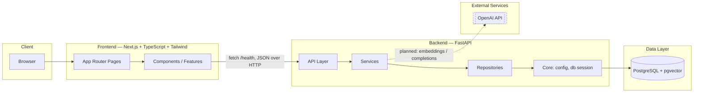

# Architecture

## Overview

The platform is a monorepo containing a Next.js frontend, a FastAPI backend, and a
PostgreSQL + pgvector database, orchestrated locally with Docker Compose.

This document reflects **Phase 1 (Project Foundation)** only. Later phases will extend
this diagram with authentication, ticketing, and the RAG/AI pipeline.

## Diagram

## Component responsibilities

| Layer | Responsibility |
|---|---|
| `frontend/app` | Routes and pages (Next.js App Router) |
| `frontend/components` | Shared, reusable presentational UI components |
| `frontend/features` | Feature-scoped UI + logic (e.g. `system-status`) |
| `frontend/hooks` | Reusable React hooks |
| `frontend/lib` | Client-side utilities and configuration |
| `frontend/types` | Shared TypeScript types |
| `backend/app/api` | HTTP route definitions (FastAPI routers) |
| `backend/app/core` | App configuration, database session, cross-cutting setup |
| `backend/app/models` | SQLAlchemy ORM models |
| `backend/app/schemas` | Pydantic request/response schemas |
| `backend/app/services` | Business logic, orchestration |
| `backend/app/repositories` | Data-access layer (queries), isolated from services |
| `backend/app/utils` | Small stateless helper functions |
| `backend/app/workers` | Background/async job entry points (future use) |

## Data flow (current)

1. The frontend dashboard calls `GET /health` on the backend.
2. FastAPI returns `{"status": "ok"}`.
3. The dashboard renders the backend's live status.

No authentication, ticketing, or AI/RAG logic exists yet — those are later phases.

## Infrastructure

- **postgres**: `pgvector/pgvector:pg16` image (PostgreSQL 16 with the `vector` extension
  preinstalled). The `vector` extension is enabled via an Alembic migration
  (`backend/alembic/versions/0001_enable_pgvector.py`).
- **backend**: FastAPI app served by Uvicorn, hot-reloading in development, connecting to
  Postgres via SQLAlchemy + psycopg.
- **frontend**: Next.js dev server, calling the backend via `NEXT_PUBLIC_API_BASE_URL`.

All three services are defined in the root [`docker-compose.yml`](../docker-compose.yml) and
started together with `docker compose up`.
